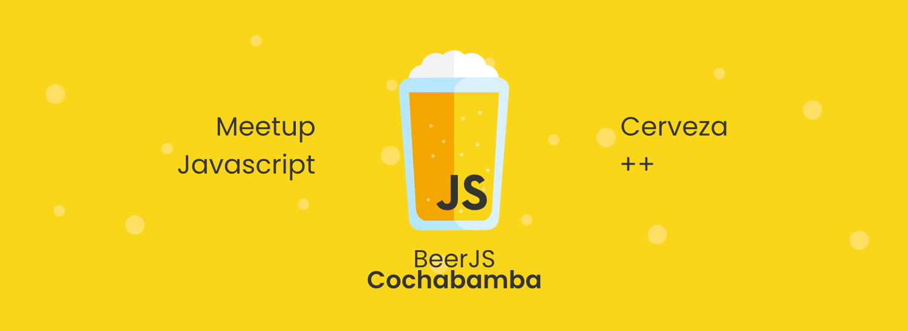

# BeerJS Cochabamba, Bolivia



## Encuentro

> - :calendar: Fecha:  El ultimo viernes de cada mes
> - :house_with_garden:  Lugar: Cowork caffe ( o el que se pueda conseguir)
> - :bookmark_tabs:  Tema: Se definira  cada mes (atentos a las redes sociales)


## Compartir

Pasar un buen rato, divertirse con javascript y relajarse con una cerveza fria o un algun bocado. esa el la idea.

## Charlar 
Charlas cortas sobre lo que mas te guste o quieras compartir de javascript y su entorno(frameworks, librerias,etc)
El tiempo por charla es de 15-30 minutos , posterior a eso generar un debate en funcion al tema
si deseas realizar una charla podes - [abrir un issue en el repo](https://github.com/beerjs/cochabamba) y entraremos en contacto contigo para futuras ediciones.
## Beber

```javascript
function enfriar (cerveza, amigos, cb) {
  if (amigos) {
    cerveza.fria = true
    cb(false, cerveza)
  } else {
    cb(true, cerveza)
  }
}
function meet ({ cerveza, amigos }) {
  return meet = new Promise((resolve, reject) => {
    enfriar(cerveza, amigos, function(err, cerveza){
      if (!err) {
        resolve({cerveza, amigos})
      } else {
        reject({cerveza, amigos})
      }
    })
  })
}
const requisitos = {
  amigos: true,
  cerveza: {
    fria: false
  }
}
meet(requisitos)
  .then(({ cerveza, amigos }) => {
    console.log('cerveza fria:', cerveza.fria)
    console.log('amigos:', amigos)
    console.log('la cerveza esta fria, los amigos la consiguieron fria y estan listos para disfrutarla')
  })
  .catch(({ cerveza, amigos }) => {
    console.log('cerveza fria:', cerveza.fria)
    console.log('amigos:', amigos)
    console.log('los amigos son necesarios para conseguir unas buenas cervezas frias')
  })
```
:beer: :pizza: :fries: :ok_hand:
## 
## Auspicio
### ¿Quieres apoyar a beerjs?
[contactanos](https://beerjscbba@gmail.com) :e-mail:
#### Siguenos en:

- [Twitter](https://twitter.com/beerjscbba)
- [Facebook](https://www.facebook.com/beerjscbba)
- [Instagram](https://www.instagram.com/beerjscbba)
- [Slack](https://beerjscocha.slack.com)
- [YouTube](https://www.youtube.com/channel/UC0KnPN2rqiMqz-KvmnVVmNA)
- [github](https://github.com/beerjs/cochabamba)

## Código de conducta

Los eventos realizados por beerJS estan sujetos al [Código de conducta](https://es.confcodeofconduct.com/) debe conocerlo si decide participar de uno.

## Organiza
[beerjscbba](https://twitter.com/beerjscbba)
Comunidad que promueve espacios de convivencia para desarrolladores amantes de javascript
Meet mes a mes , si gustas acompañanos con una cerveza o lo que gustes.

Salud :beers:

